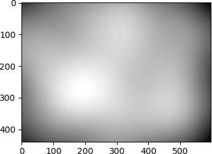
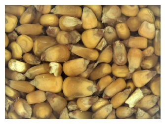
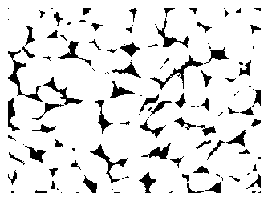

# Unsupervised Kernel Properties Extraction

We need to extract properties from grains to support downstream tasks.  Essentially this is feature extraction, but the end users want intuition about the features so we can't just use the old "bag-'o-features" trick.

Let's examine a couple images below.  Each of these images are taken the same distance from the glass behind which the grain sits.  On the left is low moisture corn, which generally has small kernels.  On the right we have high moisture corn, which generally has large swollen (larger) kernels.

  

## Step #1:  Lighting Corrections
While these images conveniently have color bands to support color corrections for different bulb outputs to maintain unit to unit consistency, we're going to ignore that for now and absorb that kind of variability into the algorithm since we don't even know for sure how reliable those bands are.  Next we trim the images and deal with non-uniform lighting.  Here we remind that most real-world images do not have uniform lighting throughout the images, which is one of the fundamental things that makes generalizing image processing algorithms difficult.  The signal (light) is not uniform and constant within and between images.  In this case, the corners/edges of the window are darker than the middle, which can cause a lot of issues with segmentation.  To deal with this, we will apply a Gaussian filter on the image to find overall lighting intensities (left image below) and subtract it off the original image (final result in right image below).

  

While the difference is subtle to our eyes, it can make a big difference with some of the algorithms we're about to use.

## Markers
Instance segmentation in images without ground truth to optimize to (unsupervised) is becoming a lost art.  Deep learning methods require extensive labels which are painful to create.  Instead, we will segment the image with the Watershed Algorithm.  However this is completely contingent on getting good markers for the objects.  We've already helped this out by evening out the lighting inconsistencies in the image, but we have to find individual "wells" (or markers) from which to "flood" and find the boundaries.  To do this we first clean up the image a bit more by performing an opening-by-morphological-reconstruction after erosion. This essentially flattens the intensities out on each of the kernels and makes the "wells" larger.  Since there aren't many dark spots on grain kernels, we caan skip the closing-by-reconstruction, but if there are a lot of dark spots left on the objects this would be a possible step to try.  Then applying Otsu's threshold we can get a sure background mask as seen in the left image.  After this a few tricks are played that include finding very rough marker locations through a couple complimentary methods, combining them through element-wise multiplication, and then applying a binary opening operation to arrive at clean markers.  Note this is where the real creative engineering happens to come up with innovative solutions.

 

