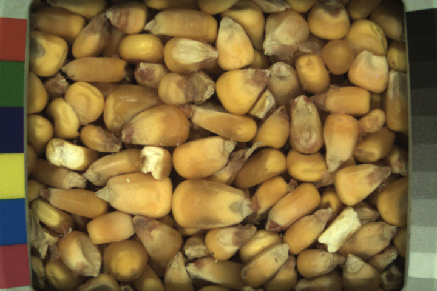
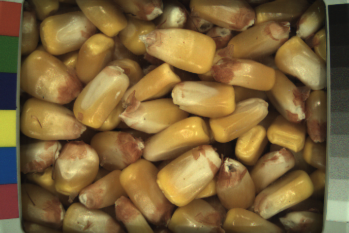
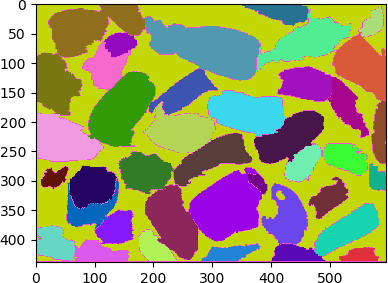
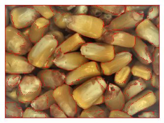

# Unsupervised Grain Kernel Properties Extraction

We need to extract properties from grains to support downstream tasks.  Essentially this is feature extraction.

Let's examine a couple images below.  Each of these images are taken the same distance from the glass behind which the grain sits.  On the left is low moisture corn, which generally has small kernels.  On the right we have high moisture corn, which generally has large swollen (larger) kernels.

  

 
                                                                 
## Unsupervised Learning Method #1

  
