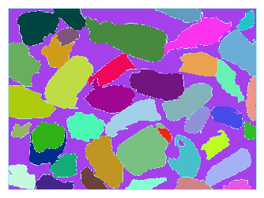
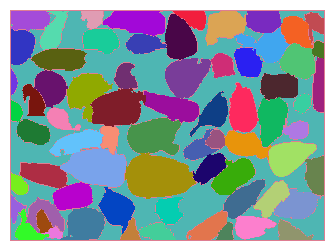
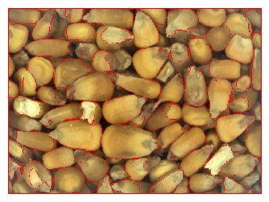

# Unsupervised Grain Kernel Properties Extraction

We need to estimate properties of grains from images to support downstream predictive and physical modeling tasks by other systems on harvesters.  Essentially this is feature extraction, or feature engineering.

Each of the example images are taken the same distance from the glass behind which the grain sits.  On the left is low moisture corn, which generally has small kernels.  On the right we have high moisture corn, which generally has large swollen (larger) kernels.

  

            

## Morphological Feature Extraction of Grain and MOG

One approach involves stacking a lot of preprocessing steps followed by fine-tuned/engineered operations such as filters and morphological image processing methods to obtain intuitive features.  The nice part about this approach is that it's fully transparent...i.e. we can "peer inside" the process to see how it's working and ensure we are obtaining the desired features.  For physical modeling tasks this approach is almost required, since deep representation learning approaches cannot guarentee interpretable features.  The results for the high and low moisture images are below. 
  
  
            
 
 
And low moisture image........
  
  
            
 
 
To obtain physical/interpretable features (e.g. aspect ratio and area).
  
  
            
 
 
These results are pretty good, and all without annotated data!! From this we can extract properties like area and aspect ratio, as well as other factors like colors to classify object instances without labels (clustering).
  

## Unsupervised Deep Learning

We can also use generative models to find properties, although the results may not be as intuitive, and the optimization process can be easy to mess up for non-experts in statistics and optimization.  This approach can be very useful for downstream predictive modeling tasks using machine learning though, so long as the dataset we train with is sufficiently representative of the important variations in the dataset.  This point cannot be overemphasized since a naive attempt to apply unsupervised learning here (i.e. one without both theoretical and domain knowledge) will generalize very poorly.  This can include linear methods (PCA) and nonlinear methods (autoencoders and variational autoencoders).
   
** unsuperivsed deep learning part to be added **
